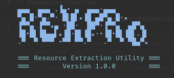
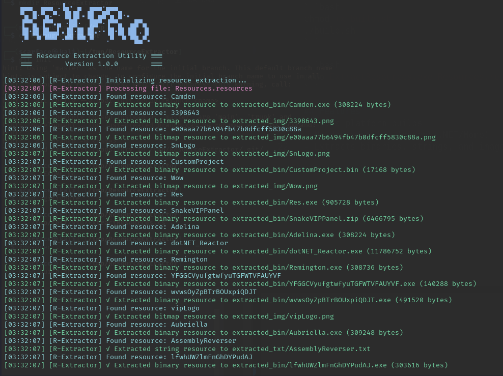
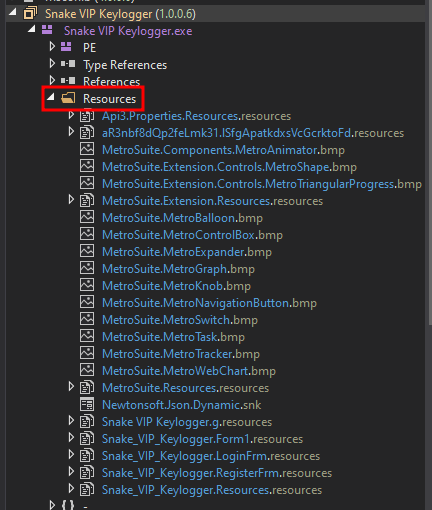

# 🔍 Resource Extraction Utility

  
*A powerful tool for extracting embedded resources from .NET assemblies*

[](https://github.com/bl4d3rvnner7/ResourceExtractor)
[](https://github.com/bl4d3rvnner7/ResourceExtractor)
[](https://github.com/bl4d3rvnner7/ResourceExtractor)

## 📥 Installation

### Prerequisites
- **Windows**: .NET Framework 4.0+ or .NET Core 3.1+
- **Linux/macOS**: Mono runtime (`sudo apt install mono-complete`)

### Quick Start
```bash
# Clone repository
git clone https://github.com/bl4d3rvnner7/ResourceExtractor.git
cd ResourceExtractor
```

## 🛠 Building

### Windows
```batch
build.bat
```

### Linux/macOS
```bash
chmod +x build.sh
./build.sh
```

  
*Example output showing resource extraction*

## 🕵️‍♂️ How to Find .resources Files

### Step 1: Extract .NET Assembly
1. Use a decompiler to export the project:
   - **dnSpy** (Windows): [Download here](https://github.com/dnSpy/dnSpy)
   - **ILSpy** (Cross-platform): [Download here](https://github.com/icsharpcode/ILSpy)

2. Open the target executable (`YourApp.exe`) in your decompiler

### Step 2: Locate Resources
1. In the decompiler's tree view, look for:
   ```
   Properties > Resources.resources
   ```
   or
   ```
   YourApp > Resources > Resources.resources
   ```

2. Right-click the `.resources` file and select:
   - **Export to Resources.resources** (dnSpy)
   - **Save Resources** (ILSpy)

> Tip: You can also export the whole project!

  
*Example: Locating resources in dnSpy*

```bash
# Windows
ExtractResources.exe Resources.resources

# Linux/macOS
mono ExtractResources Resources.resources
```


## ✨ Features

- **Multi-format Support**  
  Extracts binaries (EXE/DLL), text, images (PNG/BMP), and ZIP archives
- **Smart Detection**  
  Auto-detects file types using magic numbers
- **Organized Output**  
  Creates `extracted_bin/`, `extracted_txt/`, and `extracted_img/` directories
- **Cross-platform**  
  Works on Windows, Linux, and macOS
- **Clean Output**  
  Color-coded console output with timestamps

## 🏗 Code Structure

```csharp
// Core Functions:
- FileTypeDetector      // Magic number detection
- ResourceParser        // .resources file handling 
- Logger               // Colorful console output
```

## 📜 License

MIT License - See [LICENSE](LICENSE) for details

---

## 💡 Tips
- Look for multiple resource files (e.g., `Settings.resources`)
- Check both the main assembly and referenced DLLs
- Some resources may be embedded in code - search for `ResourceManager`

> **Pro Tip**: Drag and drop `.resources` files directly onto the executable for quick extraction!

[](https://vscode.dev/github/bl4d3rvnner7/ResourceExtractor)
